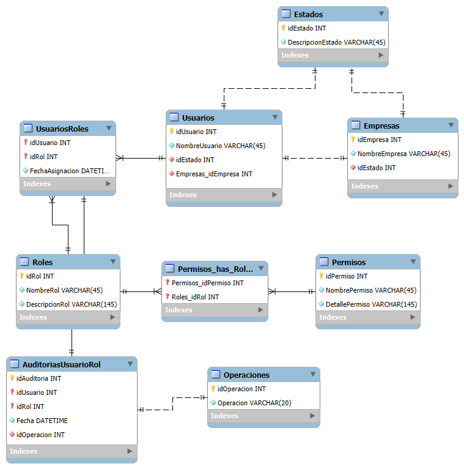

# 💡 Reto Día 01 – Gestión avanzada de usuarios y roles

---

## 🎯 Objetivo del reto

Diseñar una base de datos relacional que permita:

- Gestionar usuarios y roles en un entorno multiempresa.
- Asignar permisos a roles de manera flexible y extensible.
- Registrar asignaciones y revocaciones de roles para auditoría.
- Mantener trazabilidad completa con integridad referencial asegurada.

---

## 🗂️ Estructura del sistema

El sistema se compone de las siguientes tablas principales:

| Tabla                   | Propósito                                                                 |
|------------------------|--------------------------------------------------------------------------|
| `Estados`              | Representa el estado de entidades como Usuarios y Empresas (Ej: Activo). |
| `Empresas`             | Define las empresas del sistema.                                          |
| `Usuarios`             | Usuarios asociados a empresas y con estado definido.                     |
| `Roles`                | Roles definidos en el sistema (Ej: Admin, Lector).                        |
| `Permisos`             | Acciones que pueden ser asignadas a roles (Ej: Crear, Leer, Eliminar).   |
| `Permisos_has_Roles`   | Tabla intermedia para asignar múltiples permisos a un rol.               |
| `UsuariosRoles`        | Asigna uno o más roles a cada usuario con fecha de asignación.           |
| `Operaciones`          | Catálogo de operaciones posibles (Ej: ASIGNAR, REVOCAR).                 |
| `AuditoriasUsuarioRol` | Registra la asignación/revocación de roles con fecha y tipo de acción.  |

---

## 🧩 Modelo ER

---

## ✅ Puntos clave del reto

- ✔️ **Diseño multiempresa**: Cada usuario está vinculado a una empresa específica.
- ✔️ **Integridad referencial fuerte**: Todas las relaciones tienen claves foráneas adecuadamente implementadas.
- ✔️ **Normalización avanzada**: Diseño sin redundancias, siguiendo buenas prácticas de modelado.
- ✔️ **Gestión dinámica de permisos por rol**: Relación flexible entre permisos y roles.
- ✔️ **Auditoría con trazabilidad total**: Cada acción sobre roles queda registrada en una tabla de auditoría.
- ✔️ **Soporte para RBAC 3 (Role-Based Access Control)**: Incluye soporte para asignación de roles y auditoría por empresa y operación.

---

## 🔁 Flujo funcional del sistema

1. Se crean entidades base como empresas, estados, usuarios, roles y permisos.
2. Se asignan permisos a los roles.
3. Se asignan roles a usuarios con fecha de asignación.
4. Se registra en auditoría cada acción relevante con trazabilidad.

---

## 🧪 Datos de prueba

Incluye datos de ejemplo para validar el sistema:

- Estados: Activo, Inactivo
- Empresas: "TechCorp", "DataFlow"
- Usuarios asignados a empresas
- Roles como Admin, Lector, Supervisor
- Permisos: Crear, Leer, Modificar, Eliminar
- Relación de roles con permisos
- Asignación de roles a usuarios
- Auditoría de cada acción relevante

Consulta el archivo `test_cases.sql` para ver los INSERTs y SELECTs usados para validar.

---

## 🛠 Tecnologías utilizadas

- **MySQL Workbench** para el diseño del modelo físico inicial.
- **SQL Server Management Studio (SSMS)** para implementación final y pruebas.
- **T-SQL** como lenguaje principal para la creación de tablas, relaciones y pruebas.

---

## 📄 Archivos incluidos

| Archivo               | Descripción                                                        |
|----------------------|--------------------------------------------------------------------|
| `README.md`          | Este documento con la explicación completa del reto.               |
| `script.sql`         | Script completo de creación de base de datos y relaciones.         |
| `test_cases.sql`     | Casos de prueba: inserciones y consultas.                          |
| `diagrama.png`       | Imagen del modelo entidad-relación.                                |

---

## 🚀 Autor

**Johans Valverde**  
Desarrollado como parte de una serie de retos prácticos avanzados para fortalecer habilidades en modelado, integridad y control de acceso en bases de datos relacionales.

---
