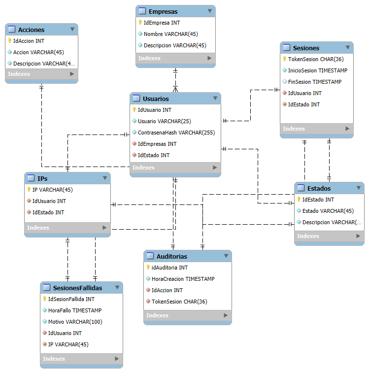

# 💡 Reto Día 02 – Autenticación y sesiones activas

---

## 🎯 Objetivo del reto

Diseñar e implementar un sistema robusto de autenticación y gestión de sesiones en un entorno multiempresa que permita:

- Registrar intentos de inicio de sesión, tanto exitosos como fallidos.
- Crear y gestionar sesiones activas seguras con tokens únicos.
- Detectar y limitar sesiones simultáneas por usuario.
- Permitir el cierre manual y automático de sesiones por inactividad.
- Mantener trazabilidad completa de accesos y acciones para auditoría.

---

## 🗂️ Estructura del sistema

El sistema se compone de las siguientes tablas principales:

| Tabla             | Propósito                                                                                 |
|-------------------|------------------------------------------------------------------------------------------|
| `Empresas`        | Define las empresas del sistema.                                                         |
| `Estados`         | Representa el estado de diferentes entidades como Usuarios, Sesiones o IPs.              |
| `Usuarios`        | Usuarios vinculados a empresas con contraseñas almacenadas como hash y estado definido.  |
| `Acciones`        | Catálogo de acciones posibles para auditoría (ej: inicio, cierre de sesión).             |
| `Sesiones`        | Registra sesiones activas y su estado, asociadas a usuarios y tokens únicos (UUID).      |
| `Auditorias`      | Registra eventos importantes relacionados con sesiones y acciones de usuario.            |
| `IPs`             | Lista de direcciones IP asociadas a usuarios y su estado (ej: sospechosa).               |
| `SesionesFallidas`| Registra intentos fallidos de inicio de sesión con motivos y direcciones IP.             |

---

## 🧩 Modelo ER

  
*(El diagrama debe mostrar las relaciones entre Usuarios, Sesiones, Auditorias, IPs, Estados, Empresas y Acciones.)*

---

## ✅ Puntos clave del reto

- ✔️ **Multiempresa**: Usuarios están asociados a empresas específicas.  
- ✔️ **Seguridad**: Contraseñas almacenadas como hash SHA2_256.  
- ✔️ **Control de sesiones**: Detecta y previene múltiples sesiones activas por usuario.  
- ✔️ **Auditoría completa**: Registro de inicios, cierres, intentos fallidos y acciones de sesión.  
- ✔️ **Gestión de IPs**: Control y registro de IPs usadas en los accesos, con estados asignados.  
- ✔️ **Cierre automático de sesión**: Procedimiento para cerrar sesiones inactivas tras un tiempo configurable.  
- ✔️ **Tokens UUID**: Cada sesión tiene un token único para identificarla de forma segura.

---

## 🔁 Flujo funcional del sistema

1. Registro y validación del usuario y contraseña ingresados.  
2. Registro o verificación de la IP de origen.  
3. Comprobación del estado del usuario (activo/inactivo).  
4. Validación de sesión activa previa para evitar múltiples sesiones simultáneas.  
5. Creación de una nueva sesión con token único si la autenticación es exitosa.  
6. Registro de auditoría para inicio de sesión y cierre de sesión (manual o automático).  
7. Registro de intentos fallidos con motivo detallado.  
8. Procedimiento automático para cerrar sesiones por inactividad.

---

## 🧪 Casos de prueba incluidos

- Inicio de sesión exitoso con usuario y contraseña correctos.  
- Intento con contraseña incorrecta.  
- Intento con usuario inexistente.  
- Intento con usuario inactivo o bloqueado.  
- Intento de iniciar sesión cuando ya hay sesión activa.  
- Cierre automático de sesiones inactivas.  
- Cierre manual de sesión por token.

Consulta el archivo `test_cases.sql` para ver los scripts de prueba.

---

## 🛠 Tecnologías utilizadas

- **SQL Server Management Studio (SSMS)** para la creación, ejecución y prueba de scripts.  
- **T-SQL** para definición de tablas, relaciones, procedimientos almacenados y lógica de negocio.

---

## 📄 Archivos incluidos

| Archivo           | Descripción                                                            |
|-------------------|------------------------------------------------------------------------|
| `README.md`       | Documento con la explicación completa del reto.                        |
| `script.sql`      | Script completo para creación de base de datos, tablas y procedimientos.|
| `test_cases.sql`  | Casos de prueba para validar la funcionalidad del sistema.             |
| `diagrama.png`    | Diagrama entidad-relación del modelo.                                 |

---

## 🚀 Autor

**Johans Valverde**  
Desarrollado como parte de una serie de retos prácticos avanzados para fortalecer habilidades en autenticación, seguridad y gestión de sesiones en bases de datos relacionales.
