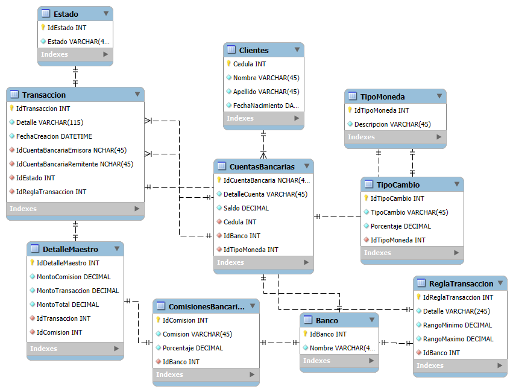

# 💡 Reto Día 03 – Transacciones Bancarias con Consistencia ACID

---

## 🎯 Objetivo del reto

Diseñar e implementar un sistema de gestión de transacciones bancarias que garantice la integridad y confiabilidad de las operaciones utilizando principios **ACID**. El sistema debe permitir:

- Realizar transferencias entre cuentas bancarias validando saldo disponible.
- Calcular y aplicar comisiones según el banco y el rango de la transacción.
- Registrar el detalle completo de cada transacción con trazabilidad.
- Asegurar que todas las operaciones sean atómicas, consistentes, aisladas y durables.
- Gestionar múltiples tipos de monedas y tasas de cambio asociadas.

---

## 🗂️ Estructura del sistema

El sistema se compone de las siguientes tablas principales:

| Tabla                 | Propósito                                                                 |
|-----------------------|--------------------------------------------------------------------------|
| `Clientes`            | Contiene información básica de los clientes del sistema.                 |
| `Banco`               | Define los bancos emisores y receptores de transacciones.                |
| `TipoMoneda`          | Lista los tipos de moneda disponibles (ej: colones, dólares).            |
| `Estado`              | Representa el estado de una transacción (ej: exitosa, fallida).          |
| `ComisionesBancarias` | Define las comisiones aplicables por banco.                              |
| `ReglaTransaccion`    | Define los rangos de monto y reglas por banco para aplicar comisiones.   |
| `CuentasBancarias`    | Cuentas de los clientes con saldos, moneda y banco asociados.            |
| `Transaccion`         | Encabezado de cada transferencia entre cuentas, incluyendo fecha y estado.|
| `DetalleMaestro`      | Detalle económico de la transacción: montos, comisiones y totales.       |
| `TipoCambio`          | Porcentajes de conversión para diferentes monedas.                       |

---

## 🧩 Modelo ER

  
*(El diagrama muestra las relaciones entre clientes, cuentas, bancos, reglas, comisiones, transacciones y tipos de moneda.)*

---

## ✅ Puntos clave del reto

- ✔️ **Atomicidad**: Todas las operaciones (débito, crédito, comisión) se realizan como una sola unidad.  
- ✔️ **Consistencia**: No se permite que el sistema quede en un estado intermedio inválido.  
- ✔️ **Aislamiento**: Transacciones concurrentes no afectan entre sí.  
- ✔️ **Durabilidad**: Los datos quedan registrados incluso ante un fallo posterior.  
- ✔️ **Control de saldo**: Se verifica que la cuenta emisora tenga fondos suficientes.  
- ✔️ **Comisiones automáticas**: Aplicación automática según reglas definidas por banco y rango.  
- ✔️ **Gestión multimoneda**: Integración de tipos de cambio por moneda.

---

## 🔁 Flujo funcional del sistema

1. El cliente solicita una transferencia entre dos cuentas.  
2. El sistema valida que ambas cuentas existan y pertenezcan a bancos válidos.  
3. Se verifica el saldo disponible de la cuenta emisora.  
4. Se consulta la comisión y regla aplicable según el banco y el monto.  
5. Se calcula el total a debitar (monto + comisión).  
6. Se ejecuta la transferencia como una transacción ACID:  
   - Se debita el monto total de la cuenta emisora.  
   - Se acredita el monto base (sin comisión) en la cuenta remitente.  
   - Se registra la transacción y su detalle financiero.  
7. En caso de fallo, se revierte toda la operación.  
8. Se registra el estado final de la transacción como exitosa o fallida.

---

## 🧪 Casos de prueba incluidos

- Transferencia exitosa con comisión aplicada correctamente.  
- Transferencia fallida por saldo insuficiente.  
- Transferencia entre cuentas en monedas distintas.  
- Validación de existencia de cuentas y bancos.  
- Registro correcto del detalle y total de transacción.  
- Comprobación de estados: transacción completada o fallida.

Consulta el archivo `test_cases.sql` para ver los scripts de prueba.

---

## 🛠 Tecnologías utilizadas

- **SQL Server Management Studio (SSMS)** para diseño, pruebas y consultas.  
- **T-SQL** para creación de tablas, relaciones, lógica de negocio y control transaccional.  
- **Transacciones explícitas** (`BEGIN TRAN`, `COMMIT`, `ROLLBACK`) para garantizar consistencia.

---

## 📄 Archivos incluidos

| Archivo           | Descripción                                                            |
|-------------------|------------------------------------------------------------------------|
| `README.md`       | Documento con la explicación completa del reto.                        |
| `script.sql`      | Script completo para creación de base de datos, tablas y procedimientos.|
| `test_cases.sql`  | Casos de prueba para validar la funcionalidad del sistema.             |
| `diagrama.png`    | Diagrama entidad-relación del modelo.                                 |

---

## 🚀 Autor

**Johans Valverde**  
Desarrollado como parte de una serie de retos prácticos avanzados para fortalecer habilidades en diseño de sistemas transaccionales con consistencia ACID en bases de datos relacionales.
