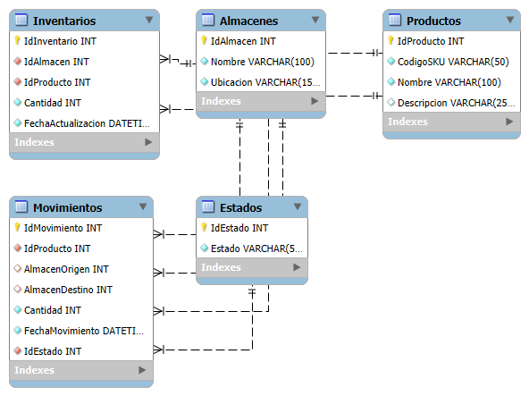

# 💡 Reto Día 04 – Control de Stock Multialmacén con Operaciones ACID

---

## 🎯 Objetivo del reto

Diseñar e implementar un sistema robusto para gestionar movimientos de stock entre múltiples almacenes, asegurando la integridad de los datos mediante el cumplimiento estricto de los principios **ACID**. El sistema debe permitir:

- Registrar ingresos, salidas y transferencias de productos entre almacenes.
- Validar existencia y suficiencia de inventario antes de cada movimiento.
- Garantizar trazabilidad completa de cada operación mediante la tabla de movimientos.
- Asegurar que las operaciones sean atómicas, consistentes, aisladas y durables.
- Evitar errores fatales usando validaciones controladas y mensajes informativos.

---

## 🗂️ Estructura del sistema

El sistema está compuesto por las siguientes tablas principales:

| Tabla               | Propósito                                                                 |
|---------------------|--------------------------------------------------------------------------|
| `Productos`         | Contiene el catálogo de productos disponibles para gestionar.            |
| `Almacenes`         | Define los almacenes físicos donde se gestiona el inventario.            |
| `Inventarios`       | Registra el stock actual de cada producto por almacén.                   |
| `Movimientos`       | Registra cada operación de ingreso, salida o transferencia de stock.     |
| `EstadoMovimiento`  | Define los tipos de movimientos (ej: ingreso, salida, transferencia).    |

---

## 🧩 Modelo ER

  
*(El diagrama muestra la relación entre almacenes, productos, inventarios, tipos de movimientos y el historial de operaciones.)*

---

## ✅ Puntos clave del reto

- ✔️ **Atomicidad**: Cada movimiento (incluyendo actualizaciones múltiples) se ejecuta como una unidad indivisible.  
- ✔️ **Consistencia**: No se permite que el inventario quede con valores negativos o inconsistentes.  
- ✔️ **Aislamiento**: Las operaciones concurrentes sobre el mismo producto o almacén no interfieren entre sí.  
- ✔️ **Durabilidad**: Los registros de movimientos y ajustes de stock permanecen aun si ocurre una falla posterior.  
- ✔️ **Control de stock**: Se valida la existencia y cantidad suficiente antes de cada operación.  
- ✔️ **Transferencias seguras**: Se realiza la transferencia entre almacenes en una única transacción.  
- ✔️ **Mensajes informativos**: El sistema responde con mensajes claros, sin abortar el proceso.

---

## 🔁 Flujo funcional del sistema

1. El usuario solicita registrar un movimiento: ingreso, salida o transferencia.  
2. El sistema valida los parámetros: existencia del producto, almacén y cantidad válida.  
3. Según el tipo de movimiento:
   - **Ingreso**: se agrega cantidad al inventario del almacén destino.
   - **Salida**: se verifica stock disponible en el almacén origen y se descuenta.
   - **Transferencia**: se descuenta del origen y se agrega al destino dentro de una misma transacción.
4. Se registra el movimiento con todos los datos necesarios (producto, almacenes, cantidad, tipo).
5. Si ocurre una falla en cualquier punto, se revierte toda la transacción.
6. Se retorna un mensaje de éxito o advertencia según corresponda.

---

## 🧪 Casos de prueba incluidos

- Ingreso exitoso a un almacén nuevo o existente.  
- Salida con stock suficiente.  
- Salida rechazada por stock insuficiente.  
- Transferencia válida entre almacenes.  
- Transferencia rechazada por stock insuficiente en origen.  
- Validación de productos y almacenes inexistentes.  
- Confirmación de registros en tabla de movimientos.

Consulta el archivo `test_cases.sql` para ver los scripts de prueba.

---

## 🛠 Tecnologías utilizadas

- **SQL Server Management Studio (SSMS)** para diseño, pruebas y consultas.  
- **T-SQL** para lógica de negocio, validaciones y control transaccional.  
- **Transacciones explícitas** (`BEGIN TRAN`, `COMMIT`, `ROLLBACK`) para asegurar confiabilidad.

---

## 📄 Archivos incluidos

| Archivo           | Descripción                                                            |
|-------------------|------------------------------------------------------------------------|
| `README.md`       | Documento con la explicación completa del reto.                        |
| `script.sql`      | Script completo para creación de base de datos, tablas y procedimientos.|
| `test_cases.sql`  | Casos de prueba para validar la funcionalidad del sistema.             |
| `diagrama.png`    | Diagrama entidad-relación del modelo.                                  |

---

## 🚀 Autor

**Johans Valverde**  
Desarrollado como parte de una serie de retos prácticos avanzados para fortalecer habilidades en diseño de sistemas transaccionales con control de stock multialmacén en entornos críticos de base de datos relacional.
